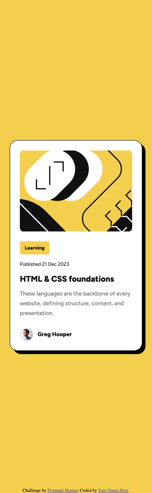

# Frontend Mentor - Blog preview card solution

This is a solution to the [Blog preview card challenge on Frontend Mentor](https://www.frontendmentor.io/challenges/blog-preview-card-ckPaj01IcS). Frontend Mentor challenges help you improve your coding skills by building realistic projects. 

## Table of contents

- [Overview](#overview)
  - [The challenge](#the-challenge)
  - [Screenshot](#screenshot)
  - [Links](#links)
- [My process](#my-process)
  - [Built with](#built-with)
  - [What I learned](#what-i-learned)
  - [Continued development](#continued-development)
  - [Useful resources](#useful-resources)
- [Author](#author)

## Overview

### The challenge

Users should be able to:

- See hover and focus states for all interactive elements on the page

### Screenshot


.png)


### Links

- Live Site URL: [Github Pages](https://frenchfulton94.github.io/Blog-Card-Project/)

## My process

### Built with

- Semantic HTML5 markup
- CSS custom properties
- Flexbox
- Mobile-first workflow

### What I learned

In this challenge I learned some key aspects of applying fuild typography in CSS. By using the clamp method, I was able to resize the fonts to specificiation by applying the minimum and maximum fonts for given screen size.

```css
:root{
    --font-size-heading: clamp(
    var(--font-size-heading-mobile),
    -0.3947rem + 7.0175vw,
    var(--font-size-heading-desktop)
  );
}
```

### Continued development

Will re-evaluate for best practices.

### Useful resources

- [MDN](https://developer.mozilla.org/) - Used to review usage of css attributes
- [Fluid Typography - Dev Community](https://dev.to/marcelluscaio/fluid-typography-1mfl) - Used to apply fluid typography
- [Fluid Type Scale Calulator - Utopia.fyi](https://utopia.fyi/type/calculator/?c=375,8,1.067,432,16,1.067,6,2,&s=0.75%7C0.5%7C0.25,1.5%7C2%7C3%7C4%7C6,s-l&g=s,l,xl,12) - Used to calculate preferred value to help transition font size;


## Author

- Website - [Under Construction]()
- Frontend Mentor - [@frenchfulton94](https://www.frontendmentor.io/profile/frenchfulton94)
